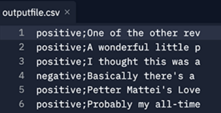

# Task 2 - Data File Parser

* Create a single function. The function must be capable of 'parsing' a UTF-8 encoded, plain text
formatted file (see ```datafile.csv``` in the left-hand-side pane, semi-colon delimited).

* The function expects three parameters, two mandatory (the source ‘input’ file location and the
exported ‘output’ file location), and an optional ‘delimiter’ with a semicolon default value.

* Your function will parse the input file, perform necessary transformations to the data and write the
transformed data to the output file.
* The output file is expected to be a line-by-line copy of the source file with the data of each line
swapping position, and the 'review' trimmed to 20 characters.
Please examine the source (input) file in the left-hand-side pane to understand its content and layout.
* An example of what the ***output*** file  should look like after your function is executed is shown below:




## As part of your implementation, you are expected to:

* Use no additional libraries or modules other than what is provided in the skeleton code.
* Your function should remove (delete) any existing ‘output’ file before it starts a parse process.
* Your function should open the source (input) file in ‘read-only’ mode specifying the correct encoding.
* Your function should ignore (do not export) any header information (I.e. the first row of data).
* Your function should close files (that are being read or written) as early as possible.
* Your function should support the use of common delimiters, i.e., commas, etc – please note, the default input file
provided only uses semicolons. The default delimiter ```(;)``` can be overridden as part of the
calling arguments if a different input file with a different delimiter is provided.
* Your function should trim (remove unwanted whitespace) and reverse the original column order (```review;sentiment ->
 sentiment;review[20] ```); each output should be on a new line.
* Your function should return the total number of records exported.
* Your function should return ```-1``` if the source (input) file does not exist.

### Note, the above list may seem overwhelming at first. You must decompose the problem and tackle small parts of it one by one to succeed.

You should test your solution yourself by making your own sufficient calls to your function(s) so that you are positive that it works as expected, regardless of the included tests.

Your final version should demonstrate evidence of being refactored; please note, refactoring is not bug-fixing - essentially it is reducing complexity and simplifying your codebase such that it is as efficient, readable, structured and as manageable as possible.

Some example calls to the function:

```js
parseFile('./datafile.csv', './outputfile.csv')  // function should return the value: 50
parseFile('./doesnotexist.csv', './outputfile.csv') // function should return the value: -1
parseFile('./doesnotexist.csv', './outputfile.csv', ',') // function should return the value: -1
```


## Additional criteria.

Once you have the version working (with tests) with the supplied ```datafile.csv```, look in the ```testing``` folder (in the left-hand side pane) and ensure that your function works as intended using these files. 


## Submission Checklist

Prior to actually submitting your final attempt you should ensure you have reviewed and considered the following checklist.


  1. Refactored ```parseFile``` function.
  2. Does your solution follow accepted coding conventions?
